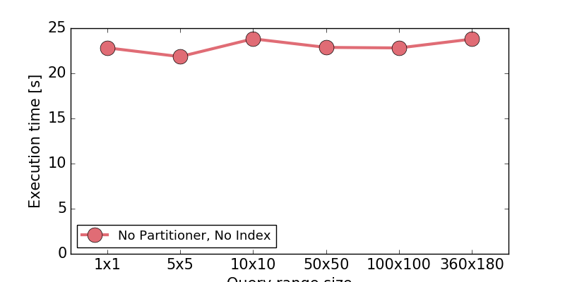
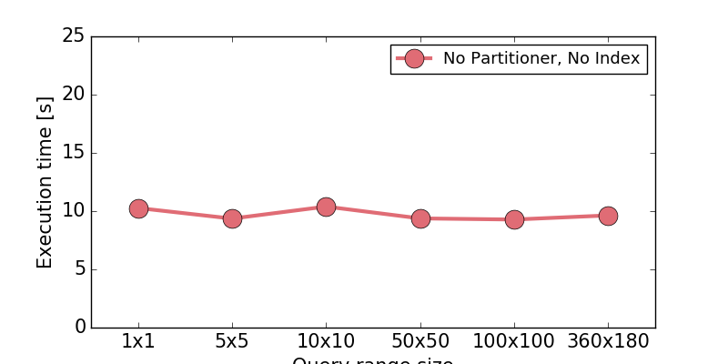
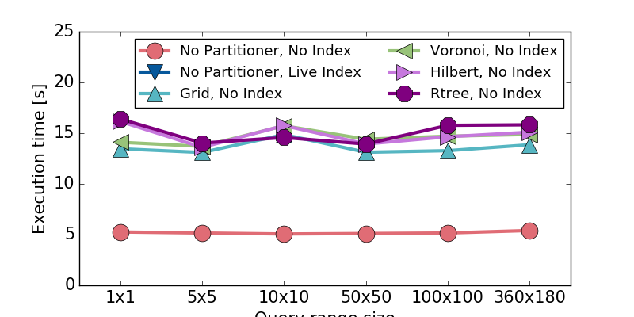
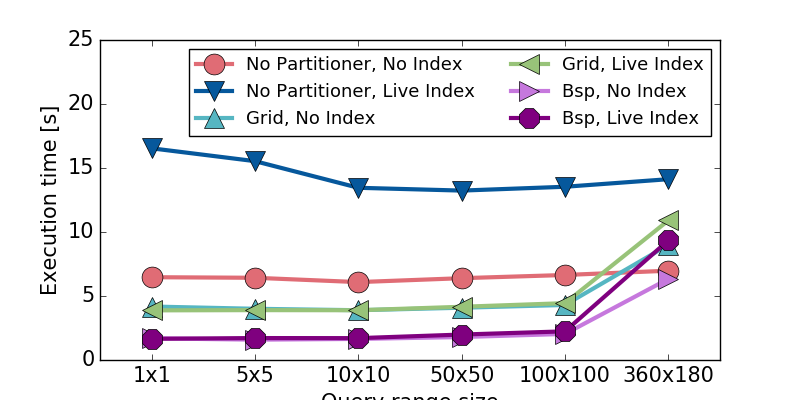
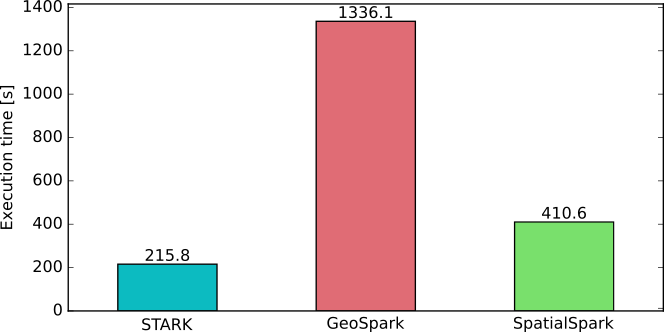
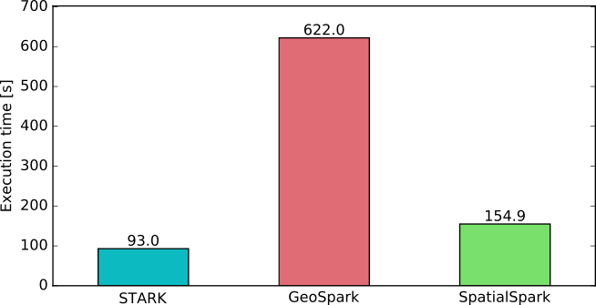
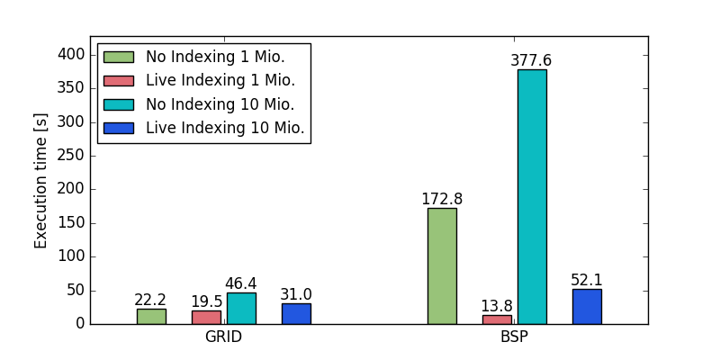
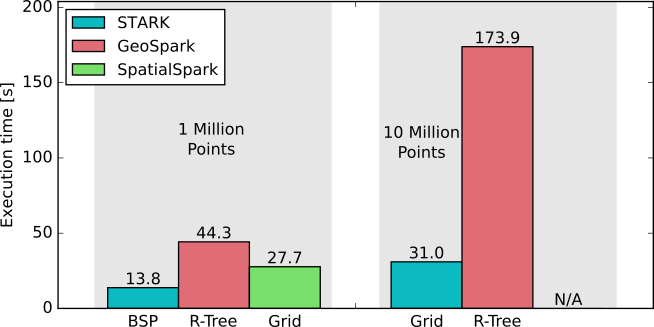

# Evaluation of Big Spatial Data Processing Engines

## Motivation
With the advance of Apache Hadoop MapReduce and Apache Spark, extensions to query spatial data on these platforms were created.
However, these platforms greatly differ in their features and of course also in performance.
While we built our [STARK](https://github.com/dbis-ilm/stark) project, we came accross related projects that we needed to compare against our implementation.

In this project we will document our tests and performance evaluation of Hadoop- and Spark-based implementations.

In this evaluation we will test the following systems:
* [STARK](https://github.com/dbis-ilm/stark)
* [GeoSpark](https://github.com/DataSystemsLab/GeoSpark)
* [SpatialSpark](https://github.com/syoummer/SpatialSpark)
* [SpatialHadoop](https://github.com/aseldawy/spatialhadoop2)

This list will be extended with newly published systems.

## Data & Setup
To run "_Big Data_" tests, we created our own data generator. The project is available [here]().

All experiments were executed on our cluster of 16 nodes, where each node has:
* Intel(R) Core(TM) i5-3470S CPU @ 2.90GHz
* 16 GB RAM
* 1 TB disk
* 1 Gbit/s network

On the cluster we have Hadoop 2.7, Spark 2.0.0 (and Spark 1.6.1 if needed), Java 1.8, and Scala 2.11.

## Spatial Filter Queries
The following images shows a spatial filter operator on a polygon data set with 50,000,000 polygons (880 GB)

*TODO*: create image

### Impact of query range size
* *SpatialHadoop*
 
* *SpatialSpark*
 
* *GeoSpark*
 
* *STARK*
 

### Point Query on Polygon DS

### Range Query (Polygon) on Polygon DS

## Spatial Join Queries
Self-join with 1,000,000 and 10,000,000 point data sets for STARK with the both partitioners.

Comparing the Self-join results for STARK and GeoSpark with the best partitioner for each platform. **Note:** GepSpark produced wrong results and ~ 100.000 result tuples were missing in both cases.

# TODOs
* add runner files
* generate missing images
